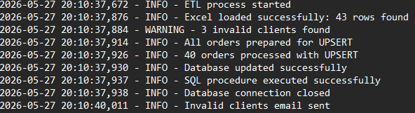
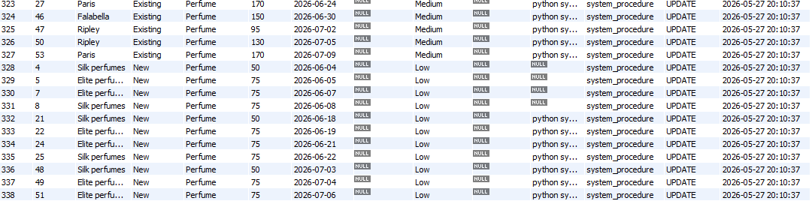

#  Automated Logistics ETL & Tracking System

An automated, end-to-end logistics tracking solution designed to modernize delivery control. 
This project replaces manual, error-prone Excel workflows with a robust Python ETL pipeline and automated logistics workflow powered by MySQL, ensuring high traceability and optimized supply chain management.

## Objective
Logistics and retail companies often manage delivery tracking manually in spreadsheets, leading to delays, duplicate records, and a lack of operational traceability. 

This system solves that by:
1. **Automating Data Extraction:** Pulling raw order data from operational Excel files.
2. **Validating & Transforming:** Filtering out invalid clients/order types and normalizing data before it hits the database.
3. **Ensuring Traceability:** Using SQL triggers to maintain a strict audit log of all inserts and updates.
4. **Proactive Alerting:** Sending automated email notifications for invalid data entries and flagging upcoming deliveries for operational follow-ups.

## Tech Stack
* **Python 3.x**: Core logic, ETL processing, and SMTP automated emails.
* **Pandas**: Data extraction, transformation, and validation.
* **MySQL**: Data storage, Stored Procedures, Triggers, and Event Scheduling.
* **python-dotenv**: Secure environment variable management.

## Project Structure

```text
├── Data/
│   ├── Orders.xlsx                 # Source operational data
│   ├── invalid_clients.csv         # Auto-generated during execution
│   └── invalid_types.csv           # Auto-generated during execution

├── images/
│   ├── logs.png
│   ├── generated_csv.png
│   └── sql_logs.png

├── .env                            # Secure credentials (ignored by Git)
├── config.py                       # Business rules and validation lists
├── main.py                         # Main Python ETL pipeline
├── schema_setup.sql                # Database schema creation
├── automation.sql                  # Triggers, procedures, events, constraints
├── etl.log                         # Auto-generated execution logs
└── README.md
```
## Key Features

### Python ETL Pipeline
* **Robust Extraction:** Reads daily `Orders.xlsx` files securely.
* **Data Validation:** Compares incoming data against a master list of valid clients and order types (`config.py`).
* **Bulk UPSERTs:** Uses `ON DUPLICATE KEY UPDATE` to seamlessly insert new orders or update existing ones without duplicating quantities.
* **Automated SMTP Alerts:** Instantly emails the operations team if invalid clients are detected during the ETL run, while storing detailed execution logs locally.

###  Automated SQL Architecture
* **Audit Logging:** `AFTER INSERT` and `AFTER UPDATE` triggers automatically populate a `log_order_updates` history table to track exactly *who* changed *what* and *when*.
* **Smart Priority Tiering:** A Stored Procedure (`proc_logistics_group`) automatically categorizes order priority (High/Medium/Low) based on the client type.
* **Event Scheduler:** A weekly scheduled event (`ev_friday_reminder`) flags upcoming deliveries that require email follow-ups.

## Environment Variables

Create a `.env` file:

```env
DB_USER=your_user
DB_PASSWORD=your_password
DB_NAME=logistics_orders

EMAIL_USER=your_email
EMAIL_PASSWORD=your_password
EMAIL_RECEIVER=receiver_email

SMTP_PORT=465
```
## Execution Example

### ETL Pipeline Logs


### Invalid Records Generated


### SQL Audit & Priority Tracking


## Usage

Place the operational Excel file inside the `Data/` folder and run:

```bash
python main.py
```

## Setup & Installation

### 1. Prerequisites

* Python 3.8+
* MySQL Server (with Event Scheduler enabled)
* A Gmail account with an App Password (for SMTP alerts)

## Install Dependencies
```bash
pip install pandas mysql-connector-python python-dotenv openpyxl
```

### 2. Clone the Repository
```bash
git clone https://github.com/Ignacio-r-g/logistics-etl-automation

cd logistics-etl-automation
```
